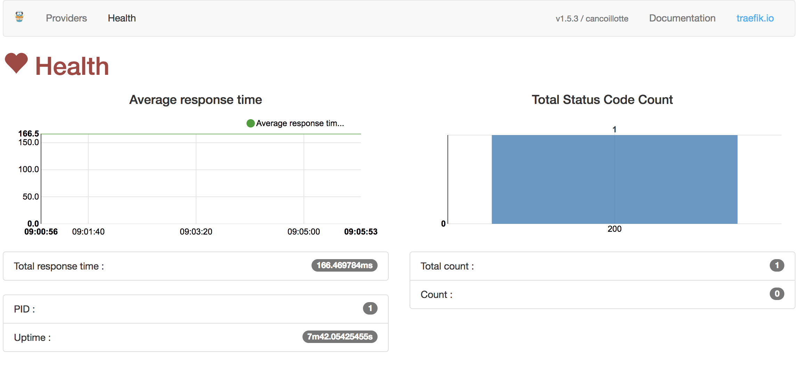
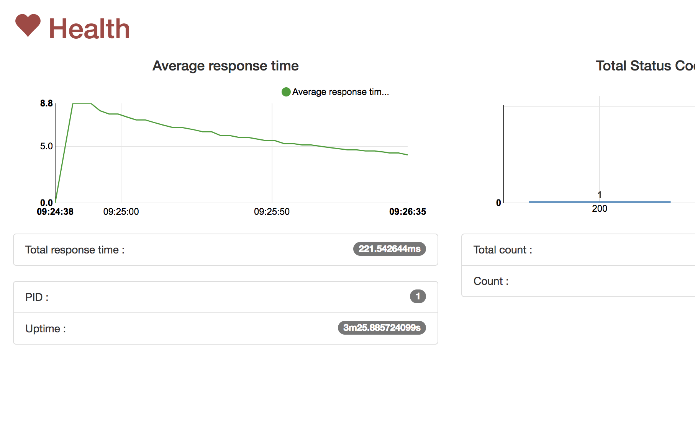
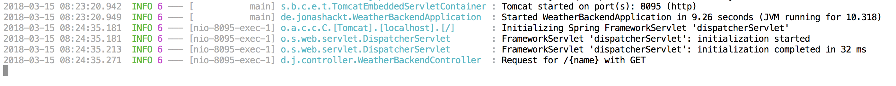
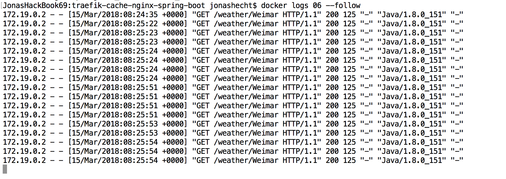

traefik-cache-nginx-spring-boot 
=============================
[](https://travis-ci.com/jonashackt/traefik-cache-nginx-spring-boot)
[](https://github.com/jonashackt/traefik-cache-nginx-spring-boot/blob/master/LICENSE)
[](https://renovatebot.com)
[](https://github.com/spring-projects/spring-boot)
[](https://github.com/spring-projects/spring-boot)

As [Traefik](https://traefik.io/) is a really gread & modern loadbalancer, but it sadly [doesn´t feature caching right now](https://github.com/containous/traefik/issues/878). So we need to put something in front of it, that is able to do caching - like old [Nginx](https://nginx.org/en/).

And as I like full examples, let´s bring in a client application (weatherclient), which want´s to call a server backend (weatherbackend). Both are implemented as simple Spring Boot microservices, as the following ASCII shows: 

```
                  -----------------------------------------------------------------------------    
                 | Docker Network scope                                                        |  
                 |                                                                             |  
                 |                                                                             |   
                 |                                                                             |
 ============    |   ==============     ================     ===============     ============  |
 =  docker- =    |   =            =     =              =     =             =     =          =  |
 = network- = -----> =   weather  = --> =    Nginx     = --> =   Traefik   = --> =  weather =  |
 =  client  =    |   =    client  =     =  (caching)   =     = (loadbalan.)=     =  backend =  |
 ============    |   ==============     ================     ===============     ============  |
                 |                                                                             |
                 |                                                                             |
                 |                                                                             |
                  -----------------------------------------------------------------------------
                 
```

It also shows, that we simulate the whole scenario with [Docker](https://www.docker.com/). To have the chance to execute everything within an intergration test, we use [docker-compose-rule](https://github.com/palantir/docker-compose-rule) and the docker-network-client app. Why?

As the weatherclient only has access to the DNS alias `weatherbackend`, if it itself is part of the Docker (Compose) network, we need another way to run an Integration test inside the Docker network scope. Therefore we use the [docker-compose-rule](https://github.com/palantir/docker-compose-rule) and the __docker-network-client__ that just calls __weatherclient__ inside the Docker network.

## HowTo Use

Everything you need to run a full build and __complete__ test (incl. Integrationtest of docker-network-client firing up all microservices that´ll call each other with client certificate support) is this:

```
mvn clean install
```

Only if you want to check everything manually - which you for sure want to do :) - fire up all components with:

```
docker-compose up -d
```

Now you can have a look at some of the components of our architecture:

Traefik: http://localhost:8080/dashboard/#/

weatherclient: http://localhost:8085/swagger-ui.html

Nginx: http://localhost:8088/

## Nginx + Traefik + weatherbackend in logical scope (aka host) with the help of Docker DNS

Additionally, in real world scenarios, Nginx + Traefik + weatherbackend would reside on a separate host with their own DNS configuration. So there´s a second "logical" scope here, which we could have implemented with tools like Vagrant - but this would have been overkill here.

Trying to imitate a machine, where Traefik + weatherbackend + Nginx are running all on one machine with DNS configured, we configure the [Docker DNS alias](https://docs.docker.com/v17.09/engine/userguide/networking/configure-dns/) for weatherbackend to the Traefik container, which routes it then to the weatherbackend. This is done with the help of this Docker Compose configuration ([see the docs](https://docs.docker.com/compose/compose-file/#aliases)):

```
  traefik:
    ...
    networks:
      default:
        aliases:
          - weatherbackend.server.test
    ...
```

Instead of configuring the weatherbackend directly to have the DNS alias `weatherbackend.server.test`, we use the Traefik Docker Compose service here - which has a similar effect to a scoped machine around Nginx, Traefik & weatherbackend. We should see the call now in Traefik GUI:



## Now installing Nginx as cache

To see what´s happening, we need to activate Nginx´ logging to the Docker log system. As we use the alpine image here, we need to [create our own Dockerfile for that](https://stackoverflow.com/a/42369571/4964553):

```
FROM nginx:alpine

# forward request and error logs to docker log collector
RUN ln -sf /dev/stdout /var/log/nginx/access.log \
    && ln -sf /dev/stderr /var/log/nginx/error.log

CMD ["nginx-debug", "-g", "daemon off;"]
```

Additionally, we need to imitate the Scope of Nginx + Traefik + weatherbackend again - now that Nginx is at front of all three:

```
  nginx:
    build: ./nginx
    ...
    ...
    networks:
      default:
        aliases:
          - weatherbackend.server.test
    ...
```

Now, the [WeatherclientController.class](https://github.com/jonashackt/traefik-cache-nginx-spring-boot/blob/master/weatherclient/src/main/java/de/jonashackt/controller/WeatherclientController.java) needs to access Nginx instead of Traefik directly. This is done with the like the [first tutorial steps with Traefik discribe](https://blog.codecentric.de/en/2017/09/traefik-modern-reverse-proxy/) - like the famous curl:

```
curl -H Host:weatherbackend.server.test http://nginx:80 -v
```

We therefore set the `Host` header when using Spring´s RestTemplate:

```
import org.springframework.http.*;
import org.springframework.web.bind.annotation.GetMapping;
import org.springframework.web.bind.annotation.PathVariable;
import org.springframework.web.bind.annotation.ResponseStatus;
import org.springframework.web.bind.annotation.RestController;
import org.springframework.web.client.RestTemplate;

import javax.annotation.PostConstruct;

@RestController
public class WeatherclientController {

    private RestTemplate restTemplate = new RestTemplate();

    /*
     * Without the System property, we won´t be able to set the Host header, see
     * https://stackoverflow.com/questions/43223261/setting-host-header-for-spring-resttemplate-doesnt-work/43224279
     * and https://stackoverflow.com/a/8172736/4964553
     */
    @PostConstruct
    public void setProperty() {
        System.setProperty("sun.net.http.allowRestrictedHeaders", "true");
    }

    @GetMapping("/forecast/{cityname}")
    @ResponseStatus(HttpStatus.OK)
    public String forecast(@PathVariable("cityname") String cityname) {

        HttpHeaders headers = new HttpHeaders();
        headers.set("Host", "weatherbackend.server.test");

        ResponseEntity<String> responseEntity = restTemplate.exchange("http://nginx:80/weather/" + cityname,
                HttpMethod.GET,
                new HttpEntity<String>(null, headers),
                String.class);

        return responseEntity.getBody();
    }
}

```

As you maybe already noticed, setting the Host header in this way [is only possible](https://stackoverflow.com/a/43224279/4964553), if we set `System.setProperty("sun.net.http.allowRestrictedHeaders", "true");`, like we do it in Spring style:

```
    /*
     * Without the System property, we won´t be able to set the Host header, see
     * https://stackoverflow.com/questions/43223261/setting-host-header-for-spring-resttemplate-doesnt-work/43224279
     * and https://stackoverflow.com/a/8172736/4964553
     */
    @PostConstruct
    public void setProperty() {
        System.setProperty("sun.net.http.allowRestrictedHeaders", "true");
    }
```

Now our setup works perfectly fine. If you fire many requests with the help of `weatherclient`, using Springfox Swagger GUI at http://localhost:8085/swagger-ui.html#!/weatherclient45controller/forecastUsingGET and do a `docker logs NginxContainerIdHere --follow` to see the logs of Nginx and a `docker logs weatherbackendContainerIdHere` to see the logs of the `weatherbackend`, you´ll notice only __one__ call in Traefik and __one__ call of the weatherbackend:





But you´ll notice many calls inside Nginx:




